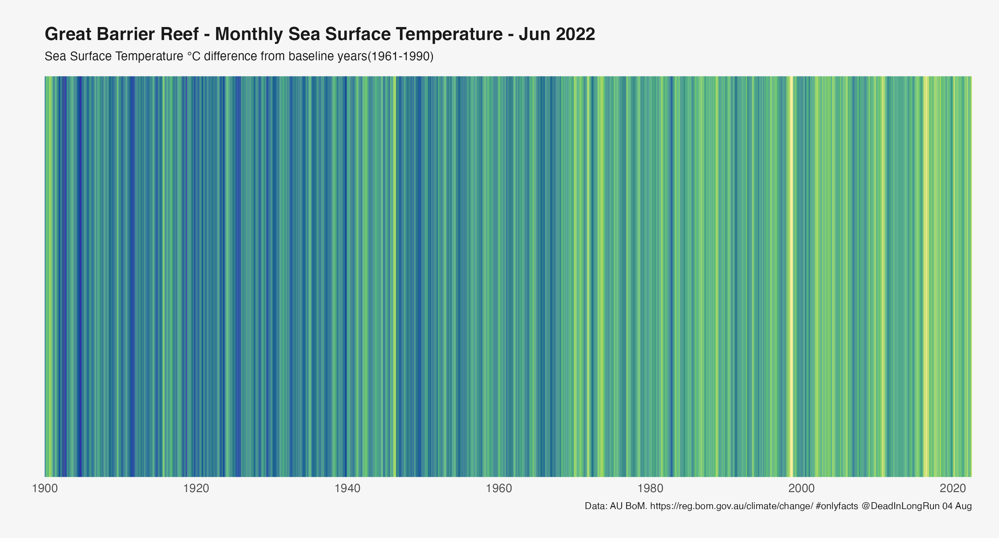

<!-- README.md is generated from README.Rmd. Please edit that file -->

# midiR

<!-- badges: start -->
<!-- badges: end -->

The goal of midiR is to allow midi tracks to be generated from notes
data frames. The aim is allow the sonification of interesting data sets.

For example, turning the sound of global temperature anomaly data into
music.

From this….



.. to treating this as the score to this…

[Fugal
Anomaly](https://soundcloud.com/citizen-science-2799538/fugal-anomaly/s-W6qa4os0N06?si=b0401cd5bf81421086ed8eb8c87f623d&utm_source=clipboard&utm_medium=text&utm_campaign=social_sharing)

## Installation

You can install the development version of midiR like so:

``` r
# FILL THIS IN! HOW CAN PEOPLE INSTALL YOUR DEV PACKAGE?
```

## Example

This is a basic example which shows you how to solve a common problem:

``` r
library(midiR)
## basic example code
```

What is special about using `README.Rmd` instead of just `README.md`?
You can include R chunks like so:

``` r
summary(cars)
#>      speed           dist       
#>  Min.   : 4.0   Min.   :  2.00  
#>  1st Qu.:12.0   1st Qu.: 26.00  
#>  Median :15.0   Median : 36.00  
#>  Mean   :15.4   Mean   : 42.98  
#>  3rd Qu.:19.0   3rd Qu.: 56.00  
#>  Max.   :25.0   Max.   :120.00
```

You’ll still need to render `README.Rmd` regularly, to keep `README.md`
up-to-date. `devtools::build_readme()` is handy for this. You could also
use GitHub Actions to re-render `README.Rmd` every time you push. An
example workflow can be found here:
<https://github.com/r-lib/actions/tree/v1/examples>.

You can also embed plots, for example:


In that case, don’t forget to commit and push the resulting figure
files, so they display on GitHub and CRAN.
